# Coloring t-SNE

[t-SNE](https://lvdmaaten.github.io/tsne/) is great at capturing a combination of the local and global structure of a dataset in 2d or 3d. But when plotting points in 2d, there are often interesting patterns in the data that only come out as "texture" in the point cloud. When the plot is colored appropriately, these patterns can be made more clear.


```python
%matplotlib inline
import matplotlib.pyplot as plt
from sklearn.cluster import MiniBatchKMeans
from sklearn.decomposition import IncrementalPCA, FastICA
from sklearn.neighbors import NearestNeighbors
from scipy.spatial.distance import euclidean
import numpy as np
```

First we load some data: a 128 dimensional embedding output from a VAE, and a 2 dimensional representation of those vectors based on running t-SNE.


```python
%time data128 = np.load('data128.npy')
print data128.shape
%time data2 = np.load('data2.npy')
print data2.shape
```

    CPU times: user 528 µs, sys: 353 ms, total: 354 ms
    Wall time: 485 ms
    (358359, 128)
    CPU times: user 442 µs, sys: 4.1 ms, total: 4.54 ms
    Wall time: 4.74 ms
    (358359, 2)


## Raw Data

When we visualize the raw data itself the "texture" is clear, but not as clear as the different "islands" and clusters.


```python
def plot_tsne(xy, colors=None, alpha=0.25, figsize=(6,6), s=0.5, cmap='hsv'):
    plt.figure(figsize=figsize, facecolor='white')
    plt.margins(0)
    plt.axis('off')
    fig = plt.scatter(xy[:,0], xy[:,1],
                c=colors, # set colors of markers
                cmap=cmap, # set color map of markers
                alpha=alpha, # set alpha of markers
                marker=',', # use smallest available marker (square)
                s=s, # set marker size. single pixel is 0.5 on retina, 1.0 otherwise
                lw=0, # don't use edges
                edgecolor='') # don't use edges
    # remove all axes and whitespace / borders
    fig.axes.get_xaxis().set_visible(False)
    fig.axes.get_yaxis().set_visible(False)
    plt.show()
    
plot_tsne(data2)
```


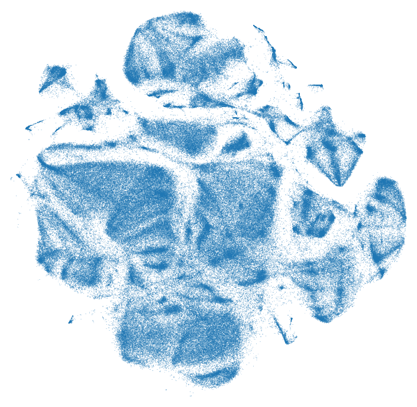


One way of pulling out a real feature from the data is to look at the nearest neighbors in 2d and see how far away they are on average in the original high dimensional space. This suggestion comes from [Martin Wattenberg](https://twitter.com/wattenberg). First we compute the indices for all the nearest neighbors:


```python
nns = NearestNeighbors(n_neighbors=10).fit(data2)
%time distances, indices = nns.kneighbors(data2)
```

    CPU times: user 1.73 s, sys: 44.1 ms, total: 1.77 s
    Wall time: 1.77 s


And then we compute the distances in high dimensional space, and normalize them between 0 and 1.


```python
distances = []
for point, neighbor_indices in zip(data128, indices):
    neighbor_points = data128[neighbor_indices[1:]] # skip the first one, which should be itself
    cur_distances = np.sum([euclidean(point, neighbor) for neighbor in neighbor_points])
    distances.append(cur_distances)
distances = np.asarray(distances)
distances -= distances.min()
distances /= distances.max()
```

In this case the distances look sort of gaussian with a long tail. We clip the ends to draw out the details in the colors.


```python
plt.hist(np.clip(distances, 0.2, 0.4), bins=50)
plt.show()
```


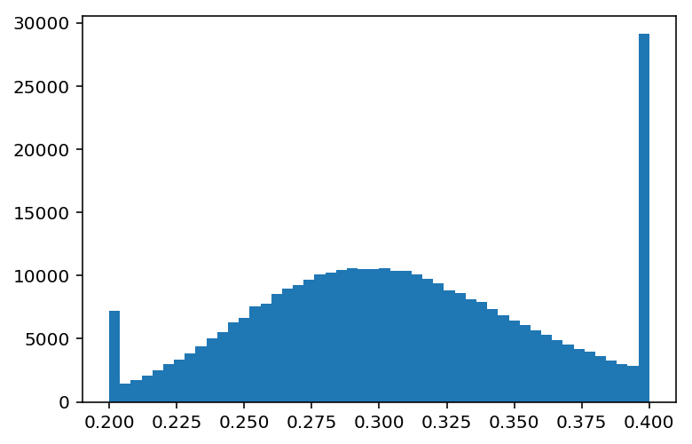


```python
plot_tsne(data2, np.clip(distances, 0.2, 0.4), cmap='viridis')
```


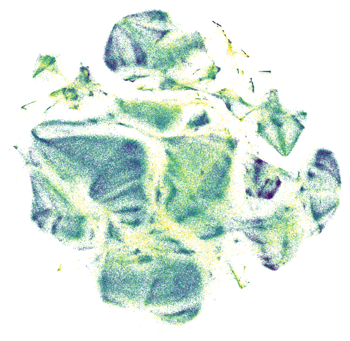


## 3D t-SNE

One technique is to compute t-SNE in 3D and use the results as colors. This can take a long time to compute with large datasets. This is the technique that was used for the [Infinite Drum Machine](https://aiexperiments.withgoogle.com/drum-machine).

```python
from bhtsne import tsne
data3 = tsne(data128, dimensions=3)
data3 -= np.min(data3, axis=0)
data3 /= np.max(data3, axis=0)
plot_tsne(data2, data3)
```

## 3D/24D PCA

Another approach is to use PCA, which is must faster but does not show as much structure in the data.


```python
pca = IncrementalPCA(n_components=3)
%time pca_projection = pca.fit_transform(data128)
pca_projection -= np.min(pca_projection, axis=0)
pca_projection /= np.max(pca_projection, axis=0)
plot_tsne(data2, pca_projection)
```

    CPU times: user 10 s, sys: 2.34 s, total: 12.4 s
    Wall time: 9.36 s


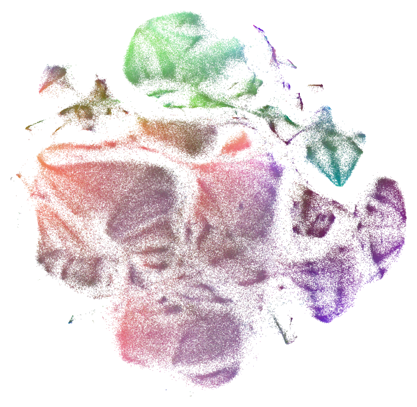


Instead of using PCA to 3D, we can also do PCA to 24 dimensions, comparing the dimensions to the median of each, and using those comparisons as bits in a 24-bit color. This suggestion comes from [Mario Klingemann](https://twitter.com/quasimondo) This technique can work well with only 12 dimensions (4 bits per color). It doesn't make sense in a "continuous" space (normalizing and multiplying the shuffled bits by the basis directly, rather than testing against the median first). That just makes the colors all muddled, more similar to the 3D PCA.


```python
def projection_to_colors(projection, bits_per_channel=8):
    basis = 2**np.arange(bits_per_channel)[::-1]
    basis = np.hstack([basis, basis, basis])
    shuffled = np.hstack([projection[:,0::3], projection[:,1::3], projection[:,2::3]])
    bits = (shuffled > np.median(shuffled, axis=0)) * basis
    # if we stacked into a 3d tensor we could do this a little more efficiently
    colors = np.vstack([bits[:,:(bits_per_channel)].sum(axis=1),
                        bits[:,(bits_per_channel):(2*bits_per_channel)].sum(axis=1),
                        bits[:,(2*bits_per_channel):(3*bits_per_channel)].sum(axis=1)]).astype(float).T
    return colors / (2**bits_per_channel - 1)
    
def pack_binary_pca(data, bits_per_channel=8):
    bits_per_color = 3 * bits_per_channel
    pca = IncrementalPCA(n_components=bits_per_color)
    pca_projection = pca.fit_transform(data)
    return projection_to_colors(pca_projection, bits_per_channel)

%time colors = pack_binary_pca(data128, 8)
plot_tsne(data2, colors)
```

    CPU times: user 11.3 s, sys: 2.59 s, total: 13.9 s
    Wall time: 10.6 s


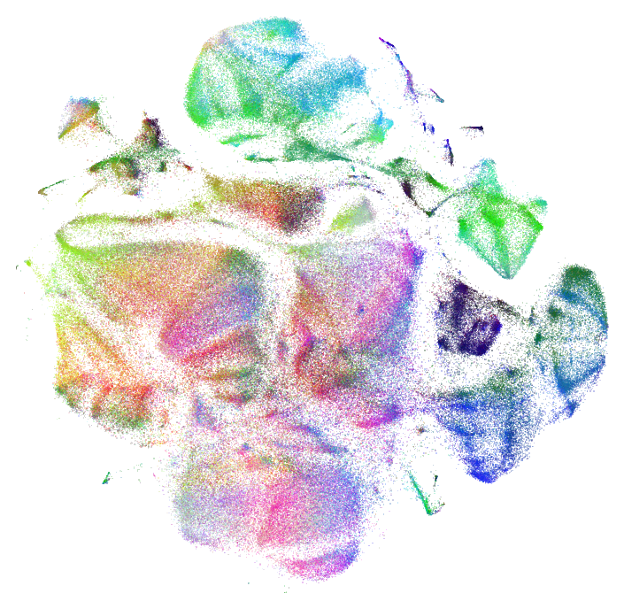


## 3D/24D ICA

Another approach is to use ICA, which can be a little slower than PCA, but shows different features depending on the data.


```python
ica = FastICA(n_components=3)
%time ica_projection = ica.fit_transform(data128)
ica_projection -= np.min(ica_projection, axis=0)
ica_projection /= np.max(ica_projection, axis=0)
plot_tsne(data2, ica_projection)
```

    /usr/local/lib/python2.7/site-packages/scipy/linalg/basic.py:884: RuntimeWarning: internal gelsd driver lwork query error, required iwork dimension not returned. This is likely the result of LAPACK bug 0038, fixed in LAPACK 3.2.2 (released July 21, 2010). Falling back to 'gelss' driver.
      warnings.warn(mesg, RuntimeWarning)


    CPU times: user 31.3 s, sys: 932 ms, total: 32.3 s
    Wall time: 15.2 s


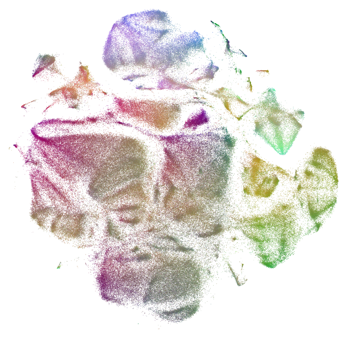


We can also do ICA to 24 dimensions and pack it into colors. This might make less sense than PCA theoretically.


```python
def pack_binary_ica(data, bits_per_channel=8):
    bits_per_color = 3 * bits_per_channel
    ica = FastICA(n_components=bits_per_color, max_iter=500)
    ica_projection = ica.fit_transform(data)
    return projection_to_colors(ica_projection, bits_per_channel)

%time colors = pack_binary_ica(data128, 8)
plot_tsne(data2, colors)
```

    /usr/local/lib/python2.7/site-packages/sklearn/decomposition/fastica_.py:116: UserWarning: FastICA did not converge. Consider increasing tolerance or the maximum number of iterations.
      warnings.warn('FastICA did not converge. Consider increasing '


    CPU times: user 2min 15s, sys: 7.01 s, total: 2min 22s
    Wall time: 1min 43s


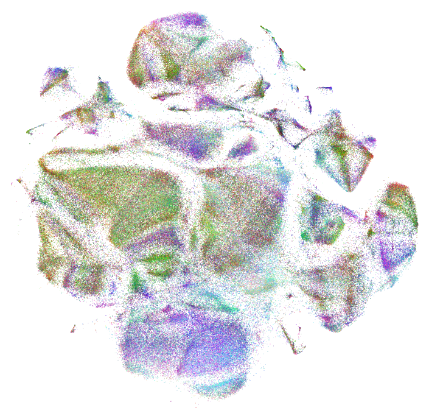


## K-Means

Another approach that shows up in the [LargeVis Paper](https://arxiv.org/abs/1602.00370) is to compute K-Means on the high dimensional data and then use those labels as color indices. We can try with 8, 30, and 128 cluster K-Means.


```python
kmeans = MiniBatchKMeans(n_clusters=8)
%time labels = kmeans.fit_predict(data128)
plot_tsne(data2, labels)
```

    CPU times: user 1.1 s, sys: 12.5 ms, total: 1.12 s
    Wall time: 1.12 s


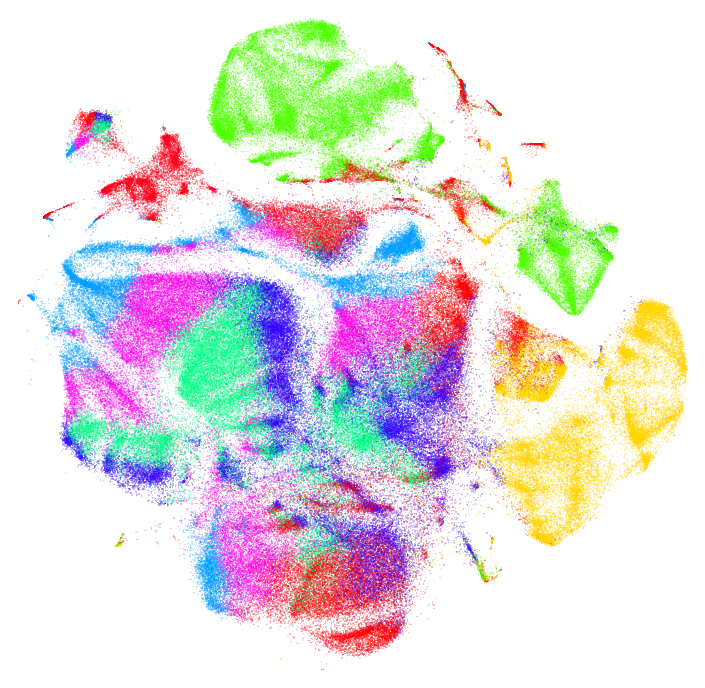


```python
kmeans = MiniBatchKMeans(n_clusters=30)
%time labels = kmeans.fit_predict(data128)
plot_tsne(data2, labels)
```

    CPU times: user 3.98 s, sys: 25.4 ms, total: 4.01 s
    Wall time: 4.02 s


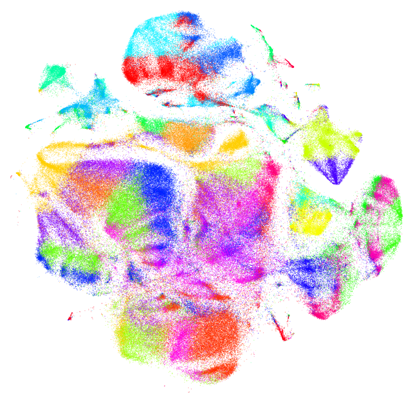


```python
kmeans = MiniBatchKMeans(n_clusters=128)
%time labels = kmeans.fit_predict(data128)
plot_tsne(data2, labels)
```

    CPU times: user 10.5 s, sys: 50.3 ms, total: 10.6 s
    Wall time: 10.6 s


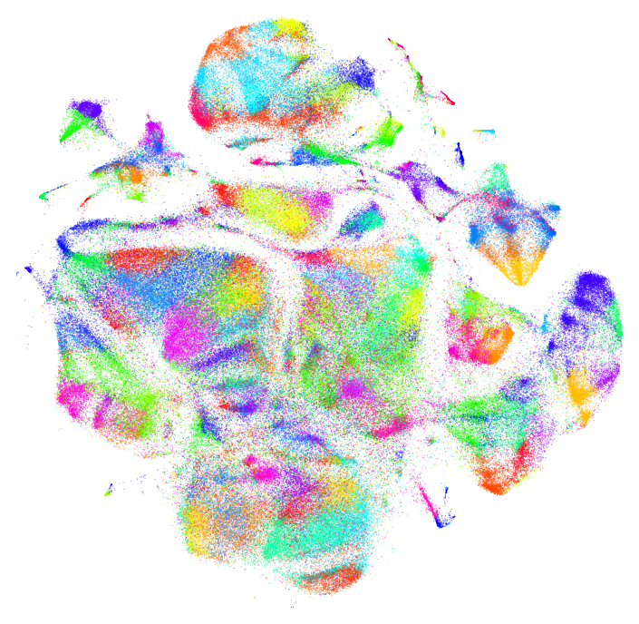


Some of the "boundaries" between colors seem fairly arbitrary, but K-Means has a nice property of allowing us to identify the centers of these color regions if we want to provide exemplars.


```python
neighbors = NearestNeighbors(n_neighbors=1, metric='euclidean')
%time neighbors.fit(data128)
%time distances, indices = neighbors.kneighbors(kmeans.cluster_centers_)

plt.figure(figsize=(6,6), facecolor='white')
plt.margins(0)
plt.axis('off')
fig = plt.scatter(data2[:,0], data2[:,1], alpha=0.5, marker=',', s=0.5, lw=0, edgecolor='', c=labels, cmap='hsv')
plt.scatter(data2[indices,0], data2[indices,1], marker='.', s=250, c=(0,0,0))
plt.scatter(data2[indices,0], data2[indices,1], marker='.', s=100, c=labels[indices], cmap='hsv')
plt.show()
```

    CPU times: user 6.64 s, sys: 28.7 ms, total: 6.66 s
    Wall time: 6.67 s
    CPU times: user 13.9 s, sys: 60.2 ms, total: 14 s
    Wall time: 14.1 s


sklearn.neighbors can be slow, but the mrpt library is much faster.

```python
import mrpt
data128f32 = data128.astype(np.float32)
%time nn = mrpt.MRPTIndex(data128f32, depth=5, n_trees=100)
%time nn.build()
def kneighbors(nn, queries, k, votes_required=4):
    return np.asarray([nn.ann(query, k, votes_required=votes_required) for query in queries])
%time indices = kneighbors(nn, data128f32[:100], 10)
```

## argmax

Another technique, arguably the most evocative, is to use the argmax of each high dimensional vector. The motivation for using argmax is that high dimensional data is so sparse that "nearby" points should have a similar ordering of their dimensions: if you sorted the dimensions of two nearby points, the difference should be small. This means that their argmax (the largest dimensions) should probably be shared. If we do this without any modification to the high dimensional data, we get a fairly homogenous plot:


```python
plot_tsne(data2, np.argmax(data128, axis=1))
```


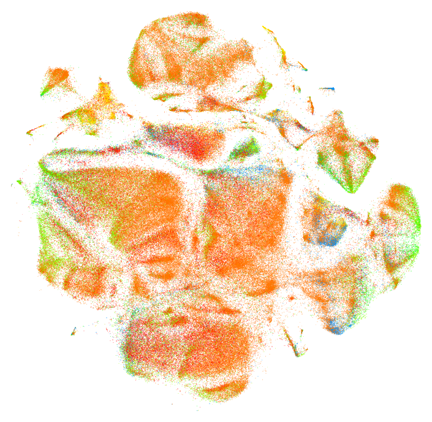


This is because a few dimensions dominate the argmax.


```python
plt.hist(np.argmax(data128, axis=1), bins=128)
plt.show()
```


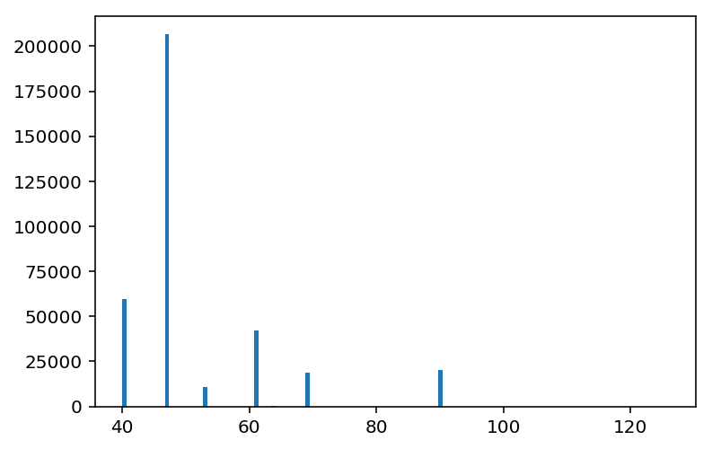


If we standardize each dimension then there is a more even distribution of possible argmax values, and therefore more even distribution of colors.


```python
def standardize(data):
    std = np.copy(data)
    std -= std.mean(axis=0)
    std /= std.std(axis=0)
    return std
```


```python
data128_standardized = standardize(data128)
plt.hist(np.argmax(data128_standardized, axis=1), bins=128)
plt.show()
```


```python
plot_tsne(data2, np.argmax(data128_standardized, axis=1))
```


In this case the high dimensional data has both negative and positive components, so it might make more sense to take the absolute value before computing the argmax. In this case, it makes things visually "messier" with too many overlapping colors.


```python
plot_tsne(data2, np.argmax(np.abs(data128_standardized), axis=1))
```


## PCA + argmax

Because some of the dimensions are correlated with each other in this case, it might make sense to do PCA before taking the argmax. Again if we take the argmax without standardizing the high dimensional data, a few colors dominate.


```python
pca = IncrementalPCA(n_components=30)
%time pca_projection = pca.fit_transform(data128)
labels = np.argmax(pca_projection, axis=1)
plot_tsne(data2, labels)
```

    CPU times: user 10.9 s, sys: 2.21 s, total: 13.1 s
    Wall time: 9.44 s


Here we can see the distribution of argmax results are concentrated toward the first dimensions of the PCA projection.


```python
plt.hist(np.argmax(pca_projection, axis=1), bins=30)
plt.show()
```


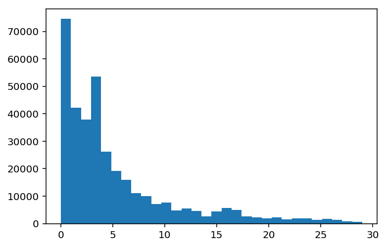


Once we standardize it we see a more even distribution.


```python
projection_standardized = standardize(pca_projection)
plt.hist(np.argmax(projection_standardized, axis=1), bins=30)
plt.show()
```


And now we can take the standardized argmax, and the argmax of the absolute values of the standardized data.


```python
plot_tsne(data2, np.argmax(projection_standardized, axis=1))
```


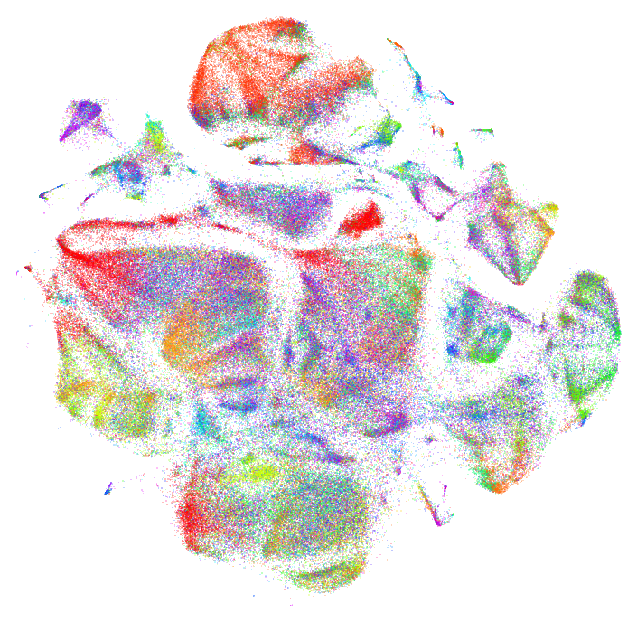


```python
plot_tsne(data2, np.argmax(np.abs(projection_standardized), axis=1))
```


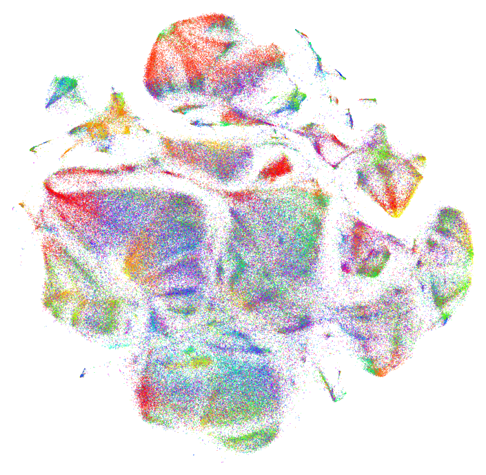


I prefer the non-absolute value argmax in this case. Now we can run the whole process again for different number of output components from PCA. Here it is for 16 and 128 dimensions.


```python
pca = IncrementalPCA(n_components=16)
%time pca_projection = pca.fit_transform(data128)
labels = np.argmax(standardize(pca_projection), axis=1)
plot_tsne(data2, labels)
```

    CPU times: user 10.4 s, sys: 2.14 s, total: 12.6 s
    Wall time: 9.18 s


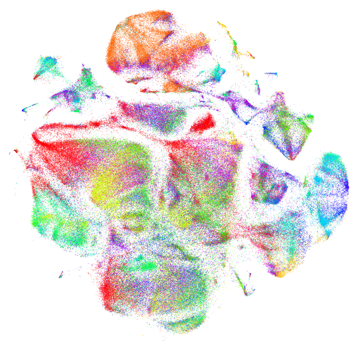


```python
pca = IncrementalPCA(n_components=128)
%time pca_projection = pca.fit_transform(data128)
labels = np.argmax(standardize(pca_projection), axis=1)
plot_tsne(data2, labels)
```

    CPU times: user 13.3 s, sys: 2.58 s, total: 15.9 s
    Wall time: 10.9 s


It should be possible to "tune" the amount of color variation by an element-wise multiplication between each PCA projected vector and a vector with some "falloff" that gives more weight to the earlier dimensions and less weight to the final dimensions.

## ICA + argmax

We can try the same technique, but using ICA instead of PCA. Here for 8, 30, and 128 dimensions.


```python
ica = FastICA(n_components=8, max_iter=500)
%time ica_projection = ica.fit_transform(data128)
labels = np.argmax(standardize(ica_projection), axis=1)
plot_tsne(data2, labels)
```

    CPU times: user 35.1 s, sys: 2 s, total: 37.1 s
    Wall time: 19.7 s


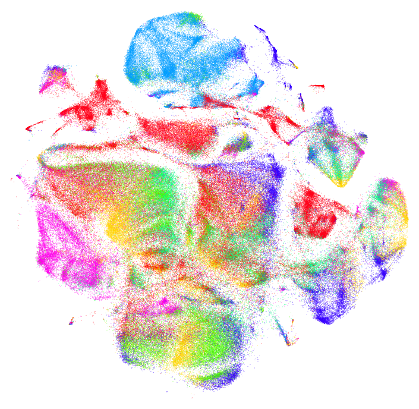


```python
ica = FastICA(n_components=30, max_iter=500)
%time ica_projection = ica.fit_transform(data128)
labels = np.argmax(standardize(ica_projection), axis=1)
plot_tsne(data2, labels)
```

    CPU times: user 51.6 s, sys: 2.05 s, total: 53.7 s
    Wall time: 31.6 s


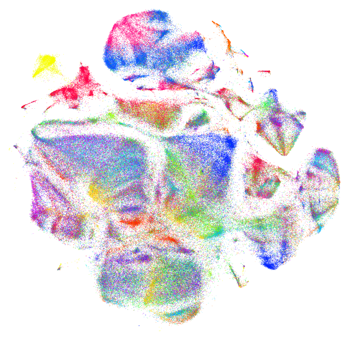


```python
ica = FastICA(n_components=128, max_iter=500)
%time ica_projection = ica.fit_transform(data128)
labels = np.argmax(standardize(ica_projection), axis=1)
plot_tsne(data2, labels)
```

    CPU times: user 4min 59s, sys: 18.3 s, total: 5min 17s
    Wall time: 3min


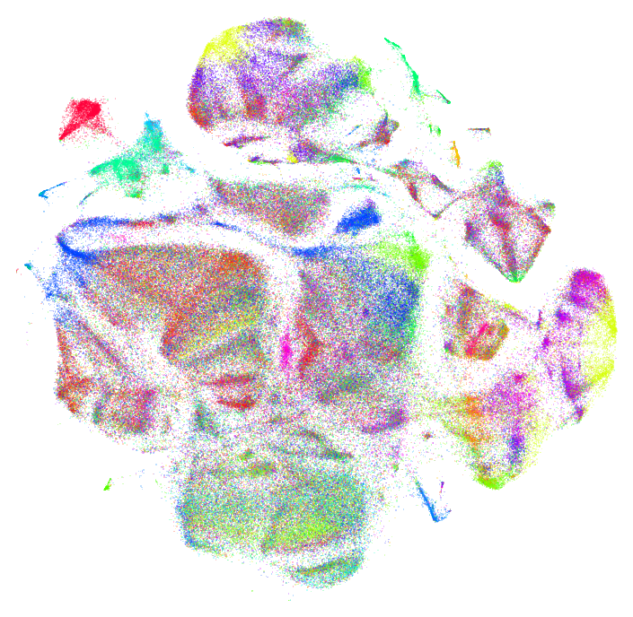


## ICA/PCA + K-Means

Finally, we can try computing K-Means on top of the dimensionality reduced vectors.


```python
kmeans = MiniBatchKMeans(n_clusters=128)
%time labels = kmeans.fit_predict(pca_projection)
plot_tsne(data2, labels)
```

    CPU times: user 10.3 s, sys: 96 ms, total: 10.4 s
    Wall time: 10.4 s


```python
kmeans = MiniBatchKMeans(n_clusters=128)
%time labels = kmeans.fit_predict(ica_projection)
plot_tsne(data2, labels)
```

    CPU times: user 8.41 s, sys: 160 ms, total: 8.57 s
    Wall time: 8.57 s


